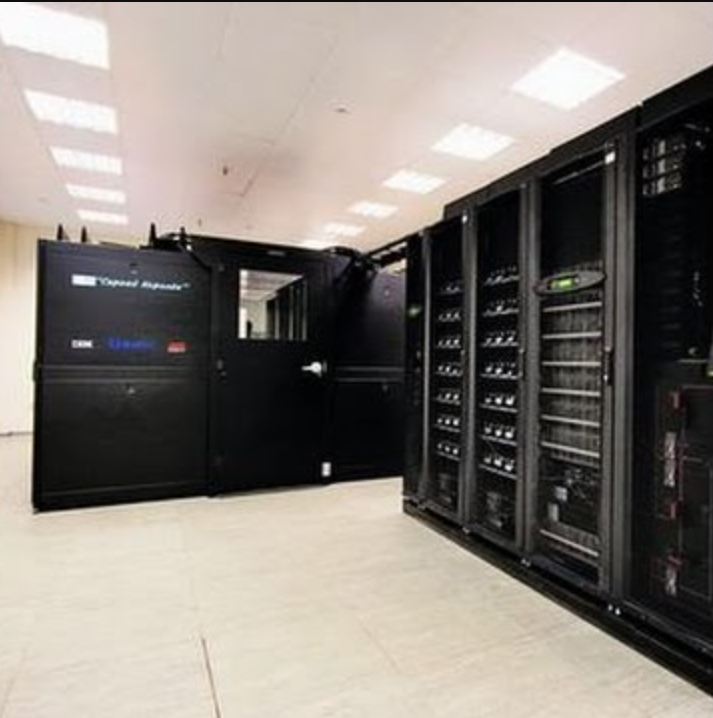
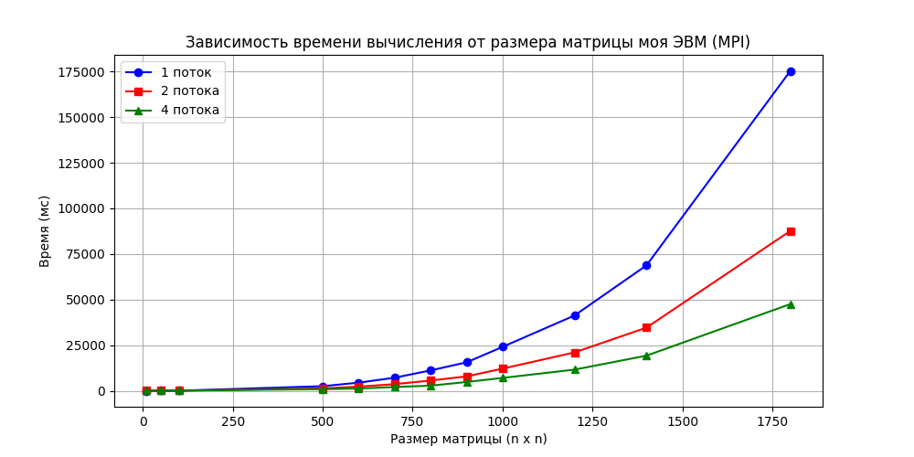
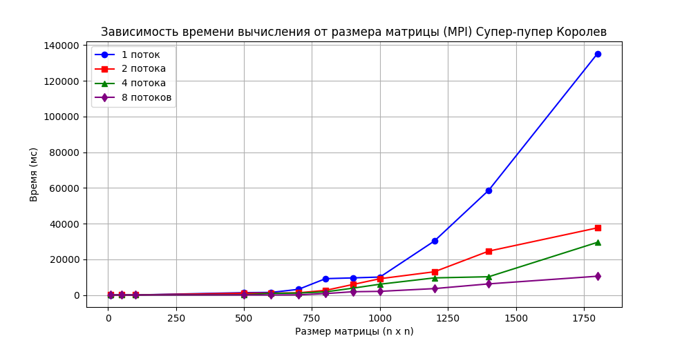

# Лабораторая №3

## Задание:
#### Модифицировать программу из л/р №1 для параллельной работы по технологии MPI.

# Описание работы на суперкомпьютере "Сергей Королев":

1. Установка необходимого ПО на удаленном компьютере - "PuTTY" и "WinSCP"
2. Перенос файлов со своей ЭВМ на удаленный компьютер 
3. подключение модулей mpi
##### 
3. Компиляция програмнных файлов(main.cpp) c помощью ПО WinSCP 
4. Запуск готового бинарного файла через PuTTY
## Общие Характеристики суперкомпьютера "Сергей Королев":
- число серверов - 187
- число процессоров - 376
- число вычислительных ядер - 2272 
- оперативная память: 6672 ГБ; 
- Производительность -  40 триллионов операций с плавающей точкой в секунду (40 ТФлопс).

## Характеристики моей "супер"ЭВМ
1. CPU - Intel(R) Core(TM) i3-8100 CPU 3.60 GHz
2. ОЗУ - 16 ГБ
3. GPU - AMD Radeon RX 5700 XT
4. Windows 10 Home
5. Максимальное число потоков - 4

### Графики 
- График выполняемый на моей ЭВМ с 1 2 и 4 потоками 
 

- График выполняемый на Королеве 1 2 4 и 8 потоками 

